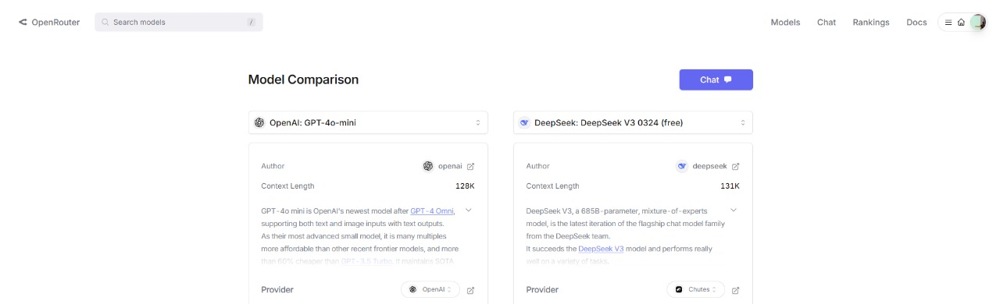

  
# **LLM Benchmarks: A Framework for Objective Evaluation**  

LLM benchmarks are standardized evaluation frameworks designed to measure and compare the performance of language models in tasks such as natural language understanding, reasoning, and domain-specific applications (e.g., technical document analysis, compliance checks). With the rapid evolution of models, these benchmarks provide a consistent methodology for assessing capabilities, ensuring transparency, and allowing stakeholders to identify the most suitable model for their needs.  

---  

## **Why Are LLM Benchmarks Important?**  

1. **Consistency**: They eliminate biases by testing models under identical conditions, enabling fair comparisons.  
2. **Real-World Relevance**: They simulate critical scenarios (e.g., bid analysis, regulatory compliance) to assess practical utility.  
3. **Driving Innovation**: By highlighting strengths and weaknesses, they encourage model improvements for specialized tasks.  

---  

## **Benchmark Test Design: Extraction of Requirements from Technical Documents**  

To assess the effectiveness of LLMs in domain-specific tasks, I conducted a controlled experiment comparing two models—**GPT-4.0 mini** (via API) and **DeepSeek: DeepSeek V3 0324**, both highly regarded in the market—for a *requirement extraction* task from a simulated attached bid document. In addition to being the most discussed models currently, they use almost the same number of parameters.  

  

### **Test Setup**  

1. **Tested Models**:  
   - **GPT-4.0 mini**: A cloud-based model with 128k parameters, accessed via API.  
   - **DeepSeek: DeepSeek V3 0324**: An open-source model with 131k parameters, accessed via API.  

2. **Input Data**:  
   - A **simulated bid document** containing requirements distributed across categories such as technical specifications, deadlines, and compliance rules.  
3. **Prompt Design**:  

**Extraction Context**:
_"Analise o seguinte documento e extraia os requisitos funcionais e não funcionais relevantes para a participação no projeto.
     Instruções:
     - Organize a resposta em duas seções: Requisitos Funcionais e Requisitos Não funcionais.
    -  Traga características do desenvolvimento do projeto.
     - Dentro de cada seção, use tópicos e subtópicos para estruturar a informação de forma clara e objetiva.
     - Retorne apenas os requisitos extraídos, sem adicionar comentários ou interpretações adicionais.
     - Mantenha a formatação em bullet points, consistente e bem organizada.
     - Existem palavras fora de contexto ou escritas errado no texto? Quais?
    -  Quantos números diferentes aparecem no texto?
"_

**Content**:
> _"Considerando o acelerado dinamismo do mercado de eventos e a imperiosa necessidade de aderência às normativas internacionais de segurança da informação, incluindo, mas não se limitando, à conformidade com padrões como PCI-DSS e aos rigorosos critérios estabelecidos pelo OWASP Top 10, o presente edital tem por finalidade a concepção e implementação de uma plataforma web robusta, integrada e multifacetada, destinada à gestão, administração e monitoramento de eventos em escala, de modo a garantir a integridade, confidencialidade e disponibilidade dos dados transacionados em todos os momentos. Ressalta-se que o projeto deverá ser concluído no prazo máximo até o dia 28/06, contemplando um período total de desenvolvimento de 3 meses.
A proposta, fundamentada em uma arquitetura orientada a serviços (SOA) e apoiada em tecnologias avançadas de processamento distribuído, visa criar um ambiente digital capaz de operar com alta disponibilidade e escalabilidade – tanto horizontal quanto vertical – através da aplicação de técnicas modernas como sharding, replicação de banco de dedos e utilização de clusters. Estes elementos serão estrategicamente integrados a um sistema de endpoints RESTful, permitindo uma comunicação segura e enficiente com APIs de terceiros, e promovendo, inclusive, a integração com gateways de pagamento e sistemas de notificação via SMS e e-mail, com suporte à autenticação OAuth 2.0 e ao gerenciamento sofisticado de tokens de acesso.
No âmbito funcional, o sistema deverá possibilitar o registro e autenticação de usuários mediante a criação de perfis diferenciados – administrador, organizador e participante –, permitindo também a criação, edição, exclusão e consulta detalhada dos eventos, com a definição de parâmetros críticos como data, local, categorias, público-alvo e descrições técnicas. De forma complementar, o sistema integrará um módulo de inscrição que se conectará a sistemas de pagamento compatíveis com certificações internacionais, gerando comprovantes digitais auditáveis. Ademais, a plataforma será preparada para integrar-se a APIs externas, por meio de endpoints RESTful, que viabilizem a comunicação segura com serviços de terceiros, bem como para gerar relatórios estatísticos e de conformidade, com auditoria contínua das operações e emissão de certificados digitais.
No que tange aos aspectos não funcionais, a solução deverá oferecer uma interface gráfica altamente intuitiva e responsiva, em conformidade com as diretrizes da WCAG, garantindo usabilidade e acessibilidade a todos os usuários, mesmo quando submetida a altos volumes de acesso simultâneo. Em termos de desempenho, o sistema deverá apresentar tempos de resposta inferiores a 2 segundos, mesmo sob condições de alta carga, utilizando técnicas avançadas de cash e otimização de consultas para mitigar eventuais gargalos e assegurar a continuidade operacional. A segurança, enquanto pilar fundamental da plataforma, será reforçada por meio da implementação de criptografia ponta a ponta, controle rigoroso de acessos e realização de auditorias periódicas, seguindo os padrões do OWASP Top 10, prevenindo e mitigando vulnerabilidades identificadas. A arquitetura do sistema será meticulosamente estruturada para suportar o crescimento sustentável, empregando técnicas como sharding, replicação e clusters para garantir escalabilidade e facilitar a manutenção e evolução sem prejuízo à estabilidade do ambiente. Por fim, o desenvolvimento do projeto será conduzido por uma equipe especializada composta por 5 profissionais, utilizando metodologias ágeis, como Scrum – já comprovado pela organização de sprints regulares –, com a utilização de ferramentas de integração contínua (CI/CD) e containers (Docker), a fim de assegurar rastreabilidade e confiabilidade durante todo o ciclo de desenvolvimento. O investimento inicial destinado ao projeto é de 75 mil reais, recurso que visa viabilizar a infraestrutura necessária e os treinamentos pertinentes à equipe.

"_

**Expected Answer**
***Functional Requirements (5 items)***:
- User Registration and Authentication with differentiated profiles.
- Event Management (creation, editing, deletion).
- Integrated Registration and Payment Module.
- Personalized Agenda and Notifications Sending (email and SMS).
- Generation of Statistical Reports and Issuance of Digital Certificates.

***Non-Functional Requirements (5 items)***:
- Usability: Intuitive and responsive interface.
- Performance: Optimized response time with cache and efficient queries.
- Security: Advanced data protection protocols and access control.
- Scalability: Modular architecture to support increased users and events.
- Maintainability: Documented code and development standards for easy maintenance.

***Project Characteristics (3 items)***:
- Team of 5 people.
- Initial investment of 75 thousand reais.
- Maximum completion deadline: 28/06 (3 months of development)
- Scrum methodology for project increment.

---
***Out-of-Context or Misspelled Words***:
- "enficiente" (should be "eficiente")
- "cash" (should be "cache")
- "banco de dedos" (should be "banco de dados")

***Different Numbers in the Text***:
- 28
- 6
- 3
- 75
- 10
- 5
- 2

Total: 7 different numbers.

4. **Evaluation Criteria**:  
   The evaluation criteria were designed to serve as allegories for the project's core requirements, testing the model's behavior when faced with questions and what the expected behavior is.

   - **Precision**: Correct identification of all requirements, 5 non-functional and 5 functional.
   - **Accuracy**: Avoid hallucinations or irrelevant content, that is, do not add information in the output.
   - **Contextual Understanding**: Ability to infer implicit requirements (for example, deadlines, misspelled words: 'banco de dedos', 'cash' and 'enficiente' and quantity of numbers).
   - **Format Compliance**: Follow the instruction to return bullet points only.
   - **Response Time**: Delay in generating response is a criterion that must be taken into account.
   - **Model Usage Price**: Since the project is done in partnership with a corporation, the monetary aspect is of utmost importance.

---

## **Methodology & Results**

1. **Execution**:  
   - Both models processed the same document with identical prompts.
   - The outputs were anonymized and reviewed.
2. **Results**:

### GPT-4.0 mini

## Functional Requirements
- **User Management**
  - Registration and authentication of users
  - Creation of differentiated profiles:
    - Administrator
    - Organizer
    - Participant
- **Event Management**
  - Creation, editing, deletion, and consultation of events
  - Definition of critical parameters:
    - Date
    - Location
    - Categories
    - Target audience
    - Technical descriptions
- **Registration Module**
  - Connection with compatible payment systems
  - Generation of auditable digital receipts
- **Integration with External APIs**
  - Secure communication with third-party services via RESTful endpoints
- **Reports and Auditing**
  - Generation of statistical and compliance reports
  - Continuous auditing of operations
  - Issuance of digital certificates

## Non-Functional Requirements
- **Usability and Accessibility**
  - Intuitive and responsive graphical interface
  - Compliance with WCAG guidelines
- **Performance**
  - Response times below 2 seconds, even under high load
  - Use of caching techniques and query optimization
- **Security**
  - Implementation of end-to-end encryption
  - Strict access control
  - Periodic audits following OWASP Top 10 standards
- **Scalability and Maintenance**
  - Structured architecture for sustainable growth
  - Use of sharding, replication, and clusters
- **Development Methodology**
  - Team composed of 5 professionals
  - Agile methodologies such as Scrum
  - Use of continuous integration (CI/CD) tools
  - Use of containers (Docker)

### Out-of-Context or Misspelled Words
- "enficiente" (should be "eficiente")
- "cash" (should be "cache")
- "banco de dedos" (should be "banco de dados")

### Different Numbers in the Text
- 28
- 6
- 3
- 75
- 10
- 5
- 2

Total: 7 different numbers.

### DeepSeek: DeepSeek V3 0324

### Functional Requirements

#### **User Management**  
- Registration and authentication of users  
- Creation of differentiated profiles:  
  - Administrator  
  - Organizer  
  - Participant  

#### **Event Management**  
- Detailed creation, editing, deletion, and consultation of events  
- Definition of event parameters:  
  - Date  
  - Location  
  - Categories  
  - Target audience  
  - Technical descriptions  

#### **Registrations and Payments**  
- Registration module integrated with internationally certified payment systems  
- Generation of auditable digital receipts  

#### **Integration with External APIs**  
- Secure communication with third-party services via RESTful endpoints  
- Support for payment gateways and notification systems (SMS and email)  
- OAuth 2.0 authentication and access token management  

#### **Reports and Auditing**  
- Generation of statistical and compliance reports  
- Continuous auditing of operations  
- Issuance of digital certificates  

---  

### Non-Functional Requirements

#### **Usability and Accessibility**  
- Intuitive and responsive graphical interface  
- Compliance with WCAG guidelines  

#### **Performance**  
- Response time below 2 seconds, even under high load  
- Advanced caching techniques and query optimization  

#### **Security**  
- Compliance with PCI-DSS and OWASP Top 10 standards  
- End-to-end encryption  
- Strict access control  
- Periodic audits  

#### **Scalability and Availability**  
- Service-oriented architecture (SOA)  
- High availability and scalability (horizontal and vertical)  
- Techniques such as sharding, database replication, and clusters  

#### **Methodology and Infrastructure**  
- Development using agile methodologies (Scrum)  
- Team of 5 professionals  
- Use of CI/CD and containers (Docker)  
- Maximum completion deadline: 28/06 (3 months of development)  
- Initial investment: 75 thousand reais  

---  

### Out-of-Context or Misspelled Words:  
- "enficiente" (should be "eficiente")  
- "banco de dedos" (should be "banco de dados")  

### Different Numbers in the Text:  
1 - 28/06  
2 - 3 months  
3 - 2 seconds  
4 - 5 professionals  
5 - 75 thousand reais  

Total different numbers: 5

3. **Main Observations**:

- **GPT-4.0 mini**:
  - Correct extraction of 5/5 functional requirements.
  - Correct extraction of 5/5 non-functional requirements.
  - Correctly identified all out-of-context or misspelled words.
  - Correctly counted the number of different numbers present in the text, which is crucial in a financial requirements context.
  - Omitted the deadline linked to a compliance rule, as well as the project's initial investment.
  - Regarding cost and speed, the model fell short, costing $0.000457 and having performance below its adversary, reaching 95.1 tps.

- **DeepSeek: DeepSeek V3 0324**:
  - Correct extraction of 5/5 functional requirements.
  - Correct extraction of 5/5 non-functional requirements.
  - Did not correctly identify all out-of-context or misspelled words, omitting the replacement of 'cash' with 'cache'.
  - Erred in counting the different numbers present in the text, pointing out only 5.
  - Included the deadline linked to a compliance rule, as well as the project's initial investment and the number of team members.
  - In terms of cost and speed, the model won on both accounts since, in addition to being free, it was much faster, reaching 740.1 tps.

**Conclusion**:

GPT-4.0 mini demonstrated higher precision and adherence to the instructions, while DeepSeek showed difficulties with implicit criteria and compliance with the prompt. Thus, the benchmark was successful in testing the two most mentioned models currently, showing that GPT-4.0 mini achieved a considerably higher accuracy rate during the tests. Finally, it is important to note that the test confirms a suspicion already raised during the project: it will not be possible to move forward without a vector database, which is necessary to achieve higher accuracy rates with the chosen model.