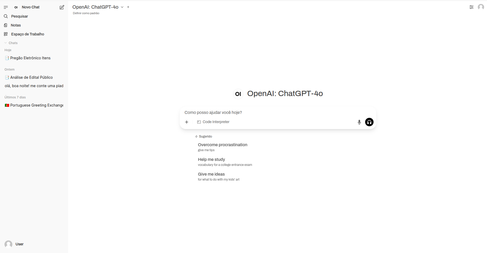
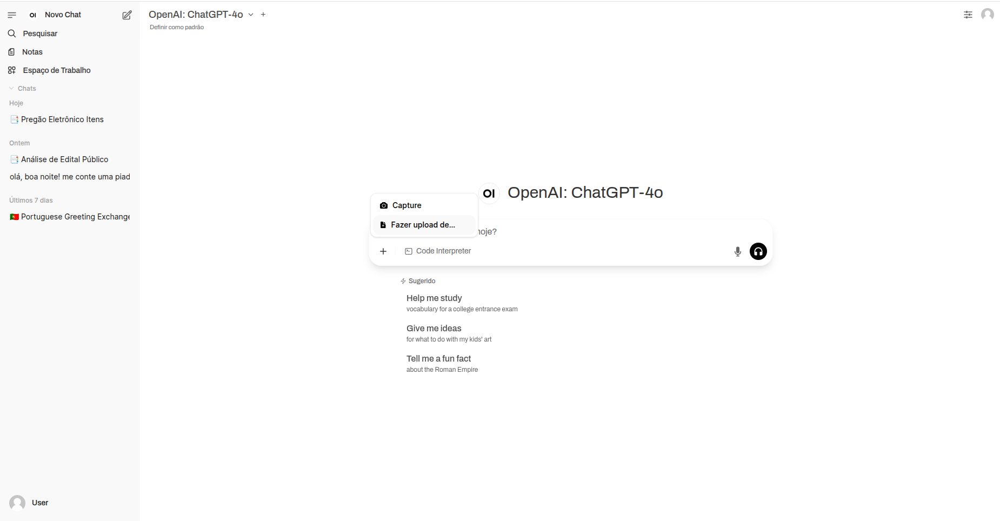
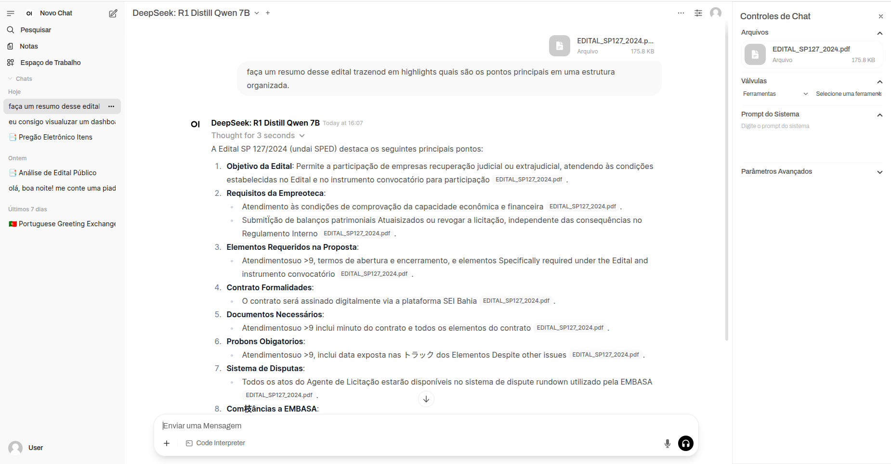
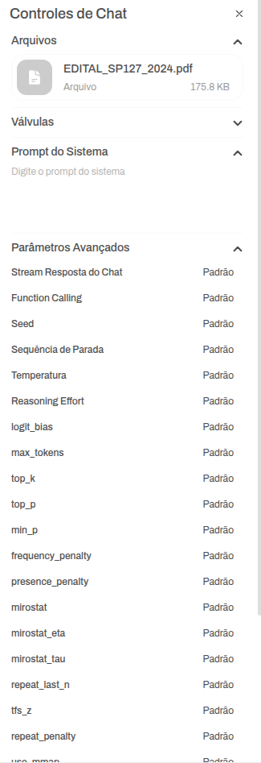
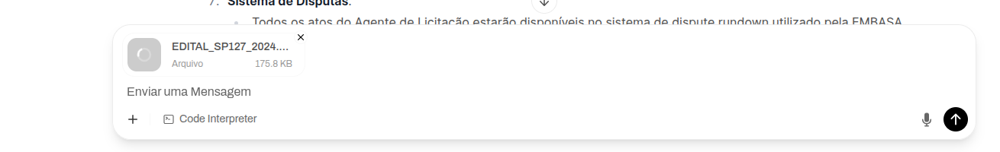
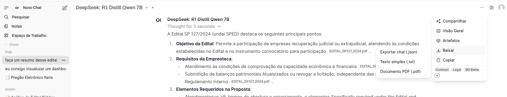

In the last sprint, the focus was on developing the requirements that the application should meet in terms of frontend. After discussions with the advisor and some research, it was decided that, at this initial stage, a ready-to-use interface would be employed to meet most of the functionalities required by the system. Thus, the chosen interface was Open WebUI — an open-source platform specifically designed for interaction with LLMs (Large Language Models).

One of the main differentiators of this choice was the native integration with OpenRouter, a system that provides an API compatible with several LLM models, offering flexibility and easy access to different technologies.

Open WebUI Interface:  
The interface is intuitive and easy to use. As an additional measure for cost savings and scalability, we opted to use the Docker environment, allowing us to outsource part of the deployment and maintenance responsibilities of the application. Below is the appearance of the platform:  

To ensure that the chosen interface meets the system’s specifications for the most part, a careful analysis was conducted for each expected functionality, testing its behavior and performance. Based on the problem analysis and the information gathered, the following essential UI/UX requirements of the system were fulfilled by the interface:

- **Upload of Tender Documents:**  
The interface must allow users to upload files in various formats (such as PDF and DOCX), with support for large documents, ensuring practicality and flexibility for the user.  
  
As we can see in the image, the platform already supports file uploads, including an integrated RAG (Retrieval-Augmented Generation). This feature is currently being tested with real tender documents to assess its effectiveness in extracting relevant information.

- **Visualization of Analysis Results:**  
Once the documents are processed, the results should be presented clearly and in a structured format, highlighting the technical and financial requirements extracted from the files.  

In the image, we can see that after a simple command to the model, the tool managed to structure the data coherently. This behavior will later be incorporated as a fixed part of the system's prompt in order to organize information more efficiently and productively. The tool also allows multiple documents to be uploaded at once, as well as customization of the prompt and some model parameters.  

- **Visible Progress Feedback:**  
During the file upload and processing, the interface should display progress indicators (such as loading bars or status messages), keeping the user informed throughout the entire process.  

The system currently includes a visual feedback feature during document upload, contributing to a more transparent and reliable user experience.

- **Intuitive and Responsive Interface:**  
The design of the interface should be simple, user-friendly, and adaptable to different devices, providing smooth navigation even for users with less technical knowledge. As demonstrated, the interface adequately meets these criteria.

- **Exporting Results:**  
The analysis results should be available for download or sharing in accessible formats such as PDF or spreadsheets, facilitating usability and information sharing.  

The export module offers three distinct formats. Two of them stand out for specific applications: PDF files can be stored in repositories such as SharePoint for future reference, while JSON files can be used to populate relational databases focused on long-term data analysis.

Conclusion  
As shown, the Open WebUI interface meets most of the expected functionalities proposed for the system. It proves to be an excellent alternative for this project, as it enables evaluation of the platform’s performance in a corporate environment, with extensive documents, and increases the effectiveness of the analysis process. As for the requirements it does not meet, it is possible to consider developing a coupled module to fulfill these additional requirements and thus generate even more value with the platform.