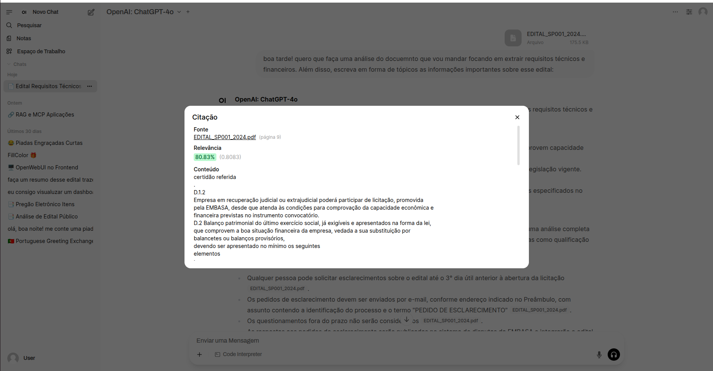

During this sprint, the project's focus ended up shifting. Since we had already made significant progress on the module development based on the frontend generated by OpenWebUI, we decided to test the platform's ability to work with attached documents — evaluating whether the extracted results were coherent, whether the model remained stable, could identify key points in the document, and most importantly, whether it avoided generating false information.

I spoke with the partner company's team to understand which documents should be prioritized for the next module, which will focus on RAG (Retrieval-Augmented Generation). After testing and deeper analysis, we decided that the best approach would be to narrow the scope to specific documents, especially RFPs (Request for Proposal). These documents are usually derived from public tenders and focus much more on technical and financial requirements. This helps avoid “polluting” the model with irrelevant data (such as legal requirements that contribute little to project viability analysis).

Additionally, a clear advantage of using the language model is that it provides an assessment of the relevance of each requirement within the overall context of the document — which can be extremely useful when prioritizing actions.

🧪 Tests Conducted During the Sprint:

During this cycle, I interviewed members of the partner company's pre-sales team in order to obtain real examples of RFPs. The goal was to understand how well the OpenWebUI file upload feature performed in real scenarios.

The testing followed this procedure:

1. We selected shorter tenders and read them entirely, manually identifying the most relevant points.
2. We uploaded the documents into the OpenWebUI interface.
3. Using the GPT-4.0 model (via ChatGPT), we requested a summary focused on technical and financial information.

📎 File used:  
[Download the file used in the test](/ams-sap.zip)  
This document contains 19 pages and vaguely describes a SAP-related project for the government of the State of Bahia. Most of the tenders we received followed a similar pattern: heavily focused on legal terms and lacking in technical or financial criteria. This reinforced our decision to prioritize RFPs, as they are much more aligned with the scope of our project.

📊 Outcome:

The LLM’s response exceeded expectations. Using one of the latest models, we observed that it performed very well when handling static documents:  
- It correctly identified and extracted key information;  
- Presented the data ranked by importance in an intuitive way;  
- Avoided hallucinating data (e.g., didn’t guess project deadlines not present in the document).

📝 Example Interaction with the Model (ChatGPT-4.0 via OpenWebUI):

USER:
Boa tarde! Quero que analise o documento que vou enviar, focando em extrair requisitos técnicos e financeiros. Além disso, escreva em forma de tópicos as informações mais importantes sobre esse edital.

ASSISTANT:  
Boa tarde! Com base nas informações extraídas do Edital SP 001/2024, segue uma análise focada:

🔹 Requisitos Financeiros:
- Empresas em recuperação judicial ou extrajudicial podem participar, desde que comprovem capacidade financeira.
- Apresentação obrigatória do Balanço Patrimonial do último exercício social.
- Substituições por balancetes ou balanços provisórios não são aceitas.
- O Balanço deve indicar boa saúde financeira, com elementos especificados no edital.

🔹 Requisitos Técnicos:
- Não presentes nos trechos analisados até o momento. Verificar outras páginas do edital para análise detalhada de qualificações técnicas.

🔹 Outras Informações Importantes:
- Qualquer pessoa pode solicitar esclarecimentos até o 3° dia útil antes da abertura da licitação.
- Os pedidos devem ser enviados por e-mail com o assunto: "PEDIDO DE ESCLARECIMENTO".
- Questionamentos fora do prazo não serão considerados.
- As respostas serão publicadas no sistema da EMBASA e farão parte do edital.

USER:  
Qual o prazo do projeto?

ASSISTANT:  
O prazo do projeto não está especificado nos trechos apresentados. Para responder com precisão, seria necessário acessar as partes do edital que tratam do cronograma e prazos de execução contratual.

📈 Highlight:  
What stood out the most was that the model avoided generating unsupported or false information — for example, it clearly stated that the project deadline could not be found in the supplied content, rather than guessing. Also impressive was the way the model organized the extracted data by level of importance:

This type of output is incredibly valuable, as it allows the pre-sales team to focus on the critical points within each RFP — a strategic approach when competing for both public and private contracts.

🧩 Conclusion:

This sprint served to validate and reassess many hypotheses we had about the project — some were confirmed, others shifted. For example, after interviews with the pre-sales team, it became clear that their greatest focus is on RFPs from companies with whom there is already some relationship. In these scenarios, competition and bureaucracy are typically lower compared to standard public bids.

Furthermore, I realized that I had been focusing on the wrong type of document at the start. I should have prioritized RFPs from the beginning, as they are more objective and aligned with the technical and financial focus of our analysis — saving valuable time for the pre-sales team.

Lastly, OpenWebUI proved to be quite promising in handling documents. It can also be easily integrated with other JavaScript-based technologies. As a result, this was a highly productive sprint that allowed us to deliver real value to the client and paved the way for the next development cycle with clearer direction.