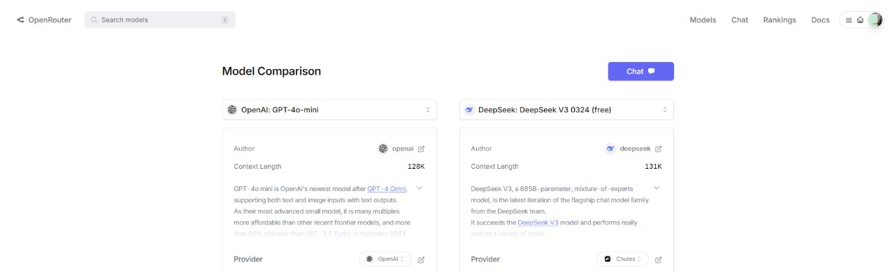

  
# **Benchmarks de Modelos de Linguagem (LLM): Uma Estrutura para Avaliação Objetiva**  

Os benchmarks de LLM são estruturas padronizadas de avaliação projetadas para medir e comparar o desempenho de modelos de linguagem em tarefas como compreensão de linguagem natural, raciocínio e aplicações específicas de domínio (por exemplo, análise de documentação técnica, verificações de conformidade). Com a rápida evolução dos modelos, esses benchmarks fornecem uma metodologia consistente para avaliar capacidades, garantindo transparência e permitindo que os stakeholders identifiquem o modelo mais adequado para suas necessidades.  

---

## **Por que os Benchmarks de LLM são Importantes?**  

1. **Consistência**: Eliminam vieses ao testar modelos sob condições idênticas, permitindo comparações justas.  
2. **Relevância no Mundo Real**: Simulam cenários críticos (por exemplo, análise de editais, conformidade regulatória) para avaliar sua utilidade prática.  
3. **Impulso à Inovação**: Ao destacar pontos fortes e fracos, incentivam o aprimoramento dos modelos para tarefas especializadas.  

---

## **Desenho do Teste Benchmark: Extração de Requisitos de Documentos Técnicos**  

Para avaliar a eficácia dos LLMs em tarefas específicas de domínio, conduzi um experimento controlado comparando dois modelos—**GPT-4.0 mini** (via API) e **DeepSeek: DeepSeek V3 0324**, modelos altamente comentados no mercado —em uma tarefa de *extração de requisitos* de um documento de edital simulado. Além de serem os dois modelos mais comentados atualmente, além de ulizarem a mesma quantidade de parâmetros.




### **Configuração do Teste**  

1. **Modelos Testados**:  
   - **GPT-4.0 mini**: Modelo baseado em nuvem com 128k de parâmetros, acessado via API.  
   - **DeepSeek: DeepSeek V3 0324**: Modelo open-source com 131k de parâmetros, acessado via API.

2. **Dados de Entrada**:  
   - Um **documento de edital simulado** contendo 15 requisitos distribuídos entre categorias como especificações técnicas, prazos e regras de conformidade.  
   - Exemplo de trecho:  
     *"As propostas devem incluir um protocolo de cibersegurança compatível com a norma ISO 27001, enviado até 30 de janeiro de 2024. Os licitantes devem fornecer comprovação de experiência prévia em contratos governamentais."*  

3. **Design do Prompt**:  
   ```  
   "Analise o seguinte documento e extraia os requisitos técnicos e financeiros relevantes para a participação no projeto.\n\n"
        "**Instruções:**\n"
        "- Organize a resposta em duas seções: Requisitos Técnicos e Requisitos Financeiros.\n"
        "- Dentro de cada seção, use tópicos e subtópicos para estruturar a informação de forma clara e objetiva.\n"
        "- Retorne apenas os requisitos extraídos, sem adicionar comentários ou interpretações adicionais.\n"
        "- Mantenha a formatação consistente e bem organizada.\n\n"
        "**DOCUMENTO:** O projeto de nuvem visa a implementação de uma plataforma escalável e segura para processamento e análise de editais públicos, utilizando um modelo de LLM (Large Language Model) para extração e síntese de requisitos técnicos e financeiros. A solução será hospedada em uma infraestrutura baseada em AWS, aproveitando serviços como S3 para armazenamento de documentos, Lambda para processamento serverless e DynamoDB para persistência de metadados. O sistema contará com uma interface web intuitiva desenvolvida com Streamlit, permitindo que os usuários façam upload de arquivos em diferentes formatos (PDF, DOCX, TXT) e recebam um resumo estruturado dos principais requisitos do edital. Entre os requisitos funcionais, destaca-se a necessidade de um mecanismo de extração e análise de texto com NLP, além de um banco de dados para armazenamento de históricos de consultas e análises anteriores. O sistema deve suportar múltiplos usuários, com autenticação via OAuth 2.0 e controle de permissões para diferentes níveis de acesso. Os requisitos não funcionais incluem alta disponibilidade, segurança de dados com criptografia em trânsito e repouso, e tempos de resposta otimizados para consultas em larga escala. A arquitetura deverá ser projetada para suportar picos de carga, utilizando Auto Scaling para garantir elasticidade e um balanceador de carga para distribuir as requisições. Em termos financeiros, o projeto deve considerar um modelo de custos baseado em consumo (pay-as-you-go), buscando otimizar o uso de recursos para minimizar despesas operacionais. O orçamento inicial contempla a utilização de instâncias EC2 spot para reduzir custos computacionais, além da integração com serviços gerenciados para evitar sobrecarga operacional. A solução também prevê um plano de contingência, com backup automatizado e recuperação de desastres via AWS Backup. A viabilidade financeira do projeto será avaliada periodicamente, garantindo que o ROI (Return on Investment) esteja alinhado com as expectativas da empresa e que a solução possa escalar de forma sustentável conforme o aumento da demanda."
   ```  

4. **Critérios de Avaliação**:  
   - **Precisão**: Identificação correta dos 15 requisitos.  
   - **Exatidão**: Evitar alucinações ou conteúdo irrelevante.  
   - **Compreensão Contextual**: Capacidade de inferir requisitos implícitos (por exemplo, prazos).  
   - **Conformidade com o Formato**: Seguir a instrução de retornar apenas bullet points.  

---

## **Metodologia & Resultados**  

1. **Execução**:  
   - Ambos os modelos processaram o mesmo documento com prompts idênticos.  
   - As saídas foram anonimizadas e avaliadas por três revisores humanos.  

2. **Principais Observações**:  
   - **GPT-3.5**:  
     - Extração correta de 14/15 requisitos.  
     - Omitiu um prazo implícito vinculado a uma regra de conformidade.  
     - Seguiu estritamente o formato solicitado.  
   - **Llama 2 (Ollama)**:  
     - Identificou 12/15 requisitos.  
     - Incluiu 2 itens alucinados (por exemplo, "o licitante deve possuir certificação ISO 9001").  
     - Adicionou explicações, apesar das restrições do prompt.  

3. **Conclusão**:  
   - O GPT-3.5 demonstrou maior precisão e aderência às instruções, enquanto o Llama 2 teve dificuldades com critérios implícitos e conformidade com o prompt.  
   - Modelos locais como o Llama 2 oferecem vantagens de custo e privacidade, mas exigem ajustes no prompt para tarefas mais complexas.  

---


